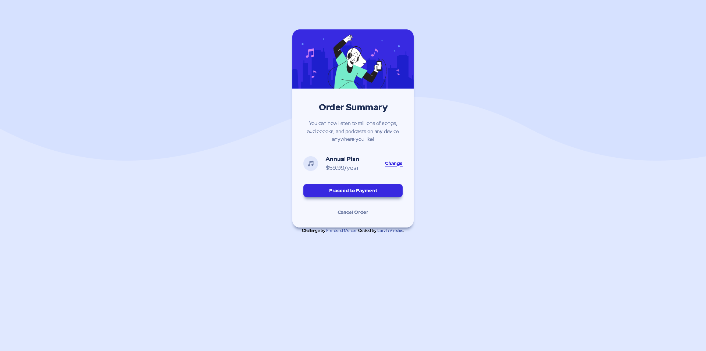

#  Frontend Mentor - Order summary card

Esta é uma solução para o [Order summary card challenge on Frontend Mentor](https://www.frontendmentor.io/challenges/order-summary-component-QlPmajDUj). Os desafios do Frontend Mentor ajudam você a melhorar suas habilidades de codificação criando projetos realistas.

##  Índice

- [Visão Geral](#visão-geral)

- [O desafio](#o-desafio)

- [Screenshot](#screenshot)

- [Links](#links)

- [Processo](#processo)

- [Construido com](#construido-com)

- [O que eu aprendi](#o=que-eu-aprendi)

- [Autor](#autor)

##  Visão Geral

###  O desafio

Os usuários devem ser capazes de:
- Ver os estados de foco para elementos interativos

###  Screenshot

###  Links

- Solution URL: [Add solution URL here](https://github.com/Larvin-Vinicius/order-summary-component-praticle)

- Live Site URL: [Add live site URL here](https://03oin.csb.app/)

##  Processo

###  Construído com

- Semantic HTML5

- CSS basico

- Flexbox

- CSS Grid

###  O que eu aprendi

- Utilizar media queries 

##  Author

- Twitter - [@yourusername](https://twitter.com/Lrv_s)
